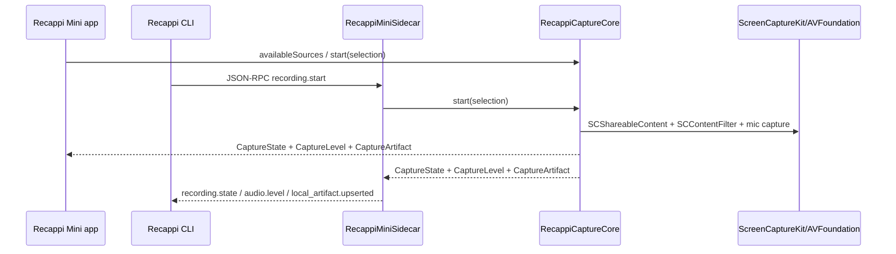

# RFC: Shared Swift Capture Core

Status: Draft for task #261
Owner: @Mini
Review: @recappi样式专家
Related: task #236, task #259, task #262

## Context

Recappi 现在有两套 macOS 录音实现：

- macOS app 的 `AudioRecorder` 负责录音状态、系统音频、麦克风、分段写入、合成、meter、诊断、Live Caption 入口和 Cloud handoff。
- CLI 的 `RecappiMiniSidecar` 另写了一套 helper 录音：source/mic listing、权限 preflight、CoreAudio process tap、麦克风采集、写文件、合成、artifact 事件。

这次 MacBook 上的 Arc app-source 静音复现说明问题不是一个小 if，而是两套 engine 的语义已经分叉：

- App 路径有 ScreenCaptureKit app-level filtering 能覆盖 Arc/Chromium helper/audio-service 进程；即使当前默认 CoreAudio backend 走 broad system tap，也不是 CLI 的单进程 include 语义。
- CLI sidecar 使用 `targetBundleId` 转 CoreAudio process object，实际只覆盖主进程，Arc tab audio 落在 helper/audio-service 进程时就会静音。
- CLI TUI waveform 也是同源问题：IPC contract 里已有 `audio.level`，但 sidecar 从未从 sample buffer 发 level。

结论：继续在 app 和 CLI 各补一套 helper 枚举、meter、writer、mixer，会让同一个产品录音语义继续漂移。应该把 macOS 录音/音频输入选择/合成核心抽成共享 Swift target，app 和 CLI helper 只做 host adapter。

## Goals

- [ ] 建立一个 UI-independent Swift capture core，成为 macOS 录音唯一产品语义来源。
- [ ] 共享系统音频 source、app source、麦克风选择、权限状态、capture lifecycle、level stream、分段写入、合成和 artifact 诊断。
- [ ] macOS app 和 CLI sidecar 都调用同一套 Swift core；不再在两边各自实现录音核心。
- [ ] 保持 CLI JSON-RPC / TUI 上层契约稳定：`sources.list`、`microphones.list`、`permissions.status`、`recording.start/stop/status`、`audio.level` 继续存在。
- [ ] 用共享 core 修复 Arc/Chromium app-source 静音，并让 CLI waveform 由真实 rms level 驱动。

## Non-Goals

- [ ] 不重写 CLI/TUI 产品界面；本 RFC 只定义 native capture core 和 host adapter 边界。
- [ ] 不改变 backend transcription / Cloud API / upload 协议。
- [ ] 不把 Live Caption 网络会话放进 capture core；core 提供本地 artifact，并预留实时 sample tap，app/sidecar host 决定是否接 Realtime。
- [ ] 不在本轮设计 Windows/Linux helper；但 JSON-RPC 外壳继续保持 OS-neutral。

## Proposal

新增 SwiftPM library target：`RecappiCaptureCore`。

初始依赖保持和现有 app/sidecar 一致，优先抽纯 Swift + Apple framework 录音能力，不引入 Sparkle、Sentry、Cloud、SwiftUI/AppKit view 层依赖。

```swift
public protocol RecordingCaptureCore {
    func availableSources() async throws -> [CaptureSource]
    func availableMicrophones() async throws -> [MicrophoneDevice]
    func permissionStatus(for selection: CaptureSelection) async -> CapturePermissions
    func requestPermissions(for selection: CaptureSelection) async throws -> CapturePermissions
    func start(_ selection: CaptureSelection, metadata: CaptureSessionMetadata) async throws -> CaptureSession
}

public protocol CaptureSession: Sendable {
    var states: AsyncStream<CaptureState> { get }
    var levels: AsyncStream<CaptureLevel> { get }

    func pause() async throws
    func resume() async throws
    func stop() async throws -> CaptureArtifact
    func cancel() async
}
```

核心数据模型：

```swift
public struct CaptureSource: Sendable, Codable, Equatable {
    public enum Kind: String, Sendable, Codable { case system, app }
    public var id: String
    public var kind: Kind
    public var label: String
    public var appName: String?
    public var bundleId: String?
}

public struct MicrophoneDevice: Sendable, Codable, Equatable {
    public var id: String
    public var label: String
    public var isDefault: Bool
}

public struct CaptureSelection: Sendable, Codable, Equatable {
    public var sourceId: String
    public var includeMicrophone: Bool
    public var microphoneDeviceId: String?
}

public struct CapturePermissions: Sendable, Codable, Equatable {
    public var screenRecording: CapturePermission
    public var microphone: CapturePermission?
}

public struct CapturePermission: Sendable, Codable, Equatable {
    public enum Status: String, Sendable, Codable { case granted, denied, unknown }
    public var status: Status
    public var requiresProcessRestart: Bool
}

public struct CaptureLevel: Sendable, Codable, Equatable {
    public enum Input: String, Sendable, Codable { case system, microphone }
    public var input: Input
    public var rmsDb: Float
    public var atMs: Int64
}
```

注意：麦克风不是 source，它是 additive input。source 只表示系统音频范围：all apps 或某个 app。

`CaptureLevel` 对外只发布物理输入 lane：`system` 和 `microphone`。core 可以在内部计算 mixed artifact 或 mixed meter，但不要把 `mixed` 透传到 sidecar IPC；现有 TS telemetry/TUI 会对 system/mic 取 max，零改动即可。如果未来必须暴露 mixed，需要同步更新 sidecar IPC contract 和 `applyRecordingEventToTelemetry`，不能依赖 fallthrough。

## Target Shape



## Backend Decision

首选方案：共享 `ScreenCaptureKitCaptureBackend`。

- [x] `availableSources()` 用 `SCShareableContent.current.applications` 构建 app source，并沿用 app 侧的 bundle collapsing 语义。
- [ ] app source capture 用 `SCContentFilter(display:including:exceptingWindows:)`，让 ScreenCaptureKit 聚合目标 app 及其 helper/audio-service 进程。
- [ ] system source capture 用 all-app system audio 过滤器。
- [ ] 麦克风继续用 `AVCaptureSession` / `AVCaptureAudioDataOutput`，但移动到 core。
- [ ] system/mic sample buffer 同时写入 `SegmentedAudioWriter` 和 level extractor，`levels` 以 10-20Hz 输出。
- [ ] stop 时由 core 返回 `CaptureArtifact`，包含 system/mic/mixed URL、duration、diagnostics、effective selection。
- [ ] capture session 预留实时 sample tap 扩展点；本轮可以不暴露正式 public API，但设计不能只能在 stop 后拿 artifact，否则后续 host 接 Live Caption 会被堵死。

可行性关键点：SCK 能否在 npm 分发的 signed headless helper 内稳定运行，且 TCC 归因正确。

需要 spike 的问题：

- [ ] helper binary 的 `Info.plist` / signing / notarization 是否能触发并持久保存 Screen Recording / audio capture TCC。
- [ ] headless helper 调 `SCShareableContent.current` 和 audio-only `SCStream` 是否需要可见 app bundle 或 LS registration。
- [ ] TCC prompt 文案显示 helper 还是 Recappi Mini，是否影响用户理解和支持成本。
- [ ] CLI-only npm helper 的 bundle identifier、Sparkle app helper、dev `--sidecar-command` 三种运行形态能否保持同一权限语义。
- [ ] 新安装、升级、权限已拒绝、权限重置后的 preflight/request 行为是否可预测。
- [ ] Screen Recording 授权后是否需要重启 helper 进程才生效；如果需要，对应 `CapturePermission.requiresProcessRestart` 和 CLI copy 必须诚实提示用户重新运行 `recappi record`，不能授权后继续录出静音。

### Phase 0 Spike Result (2026-06-26)

Local spike used an ad-hoc signed `SCKHeadlessProbe` with embedded `Info.plist`, `NSAudioCaptureUsageDescription`, `CGPreflightScreenCaptureAccess`, `SCShareableContent.current`, and an audio-only `SCStream`.

- [x] Raw headless executable can run SCK audio-only capture when launched from this already-authorized agent/terminal context. System all-apps + a probe-triggered system tone produced 202 audio buffers, 1,551,360 bytes, maxAbs `0.296528`, rms `-35.95 dB`, 48 kHz / 2ch / 32-bit float.
- [x] Raw headless executable can construct and start an app-filtered stream: `--bundle-id com.google.Chrome` matched `Google Chrome:com.google.Chrome` and produced audio buffers. The run was silent because Chrome was not playing audio; this still removes the blocker that SCK app filters require an interactive app UI.
- [x] Raw executable is not a LaunchServices-registered TCC subject by bundle id. `tccutil reset ScreenCapture com.recappi.mini.sck-headless-probe` failed with `No such bundle identifier`; current `com.recappi.mini.sidecar` has the same failure. After resetting the registered app bundle below, the raw executable still reported `preflightScreenCapture=true`, which strongly indicates parent/launcher attribution for the raw npm-binary shape.
- [x] Registered helper `.app` shape is TCC-addressable. Packaging the same probe as `SCKHeadlessProbe.app`, registering with `lsregister`, then running `tccutil reset ScreenCapture com.recappi.mini.sck-headless-probe` succeeded. Launching that app via `open` after reset produced `preflightScreenCapture=false` and `SCStreamErrorDomain Code=-3801`.
- [x] Current `RecappiMiniSidecar/Info.plist` has `NSMicrophoneUsageDescription` but lacks `NSAudioCaptureUsageDescription`; the shared SCK helper path should add the system-audio usage string.
- [x] Screen Recording grants do not become reliable inside an already-running helper. After resetting the registered helper app, launching it with an 8s pre-capture delay, inserting dev-only allow rows for the probe bundle in both user/system TCC databases, and restarting `tccd`, the same process still reported `preflightAfterDelay=false` and SCK returned `SCStreamErrorDomain Code=-3801`.
- [x] A fresh LaunchServices relaunch after the same grant succeeds. Launching the registered helper app again via `open` produced `preflightScreenCapture=true`, 153 audio buffers, 1,175,040 bytes, maxAbs `0.296528`, rms `-34.78 dB`, 48 kHz / 2ch / 32-bit float.

Spike conclusion:

- [x] **SCK backend viability: go.** Headless audio-only SCK capture and app filters work.
- [x] **Current raw npm helper TCC model: no-go for helper-owned permission UX.** If we want predictable helper-owned TCC, the packaged helper should become a signed/notarized helper `.app` or equivalent LaunchServices-registered bundle, and the CLI resolver/package layout must support LaunchServices-based execution. Directly spawning `.app/Contents/MacOS/RecappiMiniSidecar` must not be treated as equivalent until TCC attribution is re-verified.
- [x] **Screen Recording grant path requires helper restart.** `CapturePermission.requiresProcessRestart` should be `true` after a new Screen Recording grant/reset recovery; CLI copy should tell the user to re-run `recappi record` instead of continuing a silent/denied capture in the same process.
- [x] **No CoreAudio fallback decision is needed for this RFC.** The TCC blocker is packaging/launch attribution, not SCK capture capability; continue with the shared SCK core and helper `.app` packaging.
- [x] **Permission UX must name the helper as Recappi.** The packaged `.app` needs a user-recognizable display name and icon so System Settings > Privacy & Security > Screen & System Audio Recording does not show a probe-style name or raw bundle id.

Fallback 方案只作为 TCC blocked 时的显式决策，不作为默认实现：

- [ ] 保留共享 `RecordingCaptureCore` interface 和 host adapter。
- [ ] app 使用 `ScreenCaptureKitCaptureBackend`。
- [ ] sidecar 临时使用 `CoreAudioProcessTapBackend`，但也必须共享 source resolution、mic capture、level stream、writer、mixer、artifact。
- [ ] fallback 需要 @peng-xiao 明确批准，因为它没有彻底消除 app/CLI 底层 backend 差异。

## Host Responsibilities

macOS app:

- [ ] `AudioRecorder` 降级为 `@MainActor` UI/state adapter。
- [ ] 订阅 `states` / `levels` 更新 `RecorderState`、waveform、meter、Done state。
- [ ] 继续负责 UI 权限 primer、Cloud upload/transcribe handoff、Live Caption 网络会话、Sentry/reporting。
- [ ] 不再直接拥有系统音频/mic/writer/mixer 的具体实现。

CLI sidecar:

- [ ] 只保留 JSON-RPC adapter、account partition、本地 artifact event 映射、进程生命周期。
- [ ] `sources.list` / `microphones.list` / `permissions.status` 直接调用 core。
- [ ] `recording.start` 调 core，转发 `recording.state`、`audio.level`、`local_artifact.upserted`。
- [ ] 权限错误复用 CLI `recordErrorCopy` 体系：给 System Settings 路径、不给内部路径/stack/upload 细节，并覆盖 `requiresProcessRestart` 的重新运行提示。
- [ ] Screen Recording 未授权或刚授权时，用户文案统一走 "enable Recappi helper app, then run `recappi record` again"；不要暗示当前 helper 进程能在授权后继续录，也不要暴露 helper/sidecar/TCC/SCK 等内部词。
- [ ] 删除 sidecar 内重复 CoreAudio tap、AVCapture mic、writer、mixer 实现。

Permission copy shape:

- Screen Recording denied/unknown:
  `Recappi needs Screen Recording permission to capture audio. Open System Settings -> Privacy & Security -> Screen Recording, turn on {APP_DISPLAY_NAME}, then run recappi record again.`
- Screen Recording newly enabled / `requiresProcessRestart=true`:
  `Screen Recording enabled. Run recappi record again to start - the recorder needs a fresh launch to pick up the new permission.`
- Microphone remains a separate line only when `includeMicrophone=true`.

CLI/TUI TypeScript:

- [ ] 不需要产品契约改动。
- [ ] 继续把 sidecar `audio.level { input, rmsDb, atMs? }` 映射到 `levelFromRmsDb`、telemetry 和 waveform；IPC 只发 `system` / `microphone`。
- [ ] 保留没有 level telemetry 时的 honest fallback copy，但真实 helper 应该持续发 level。

## Migration Plan

### Phase 0: RFC + SCK Helper Feasibility

- [x] 写完本 RFC，拿 @recappi样式专家 review 接口和 UX fallback。
- [x] 做最小 signed helper spike：headless helper 调 SCK list + audio-only capture。
- [x] 在 fresh TCC 环境验证 permission preflight/request、拒绝态、重置态。
- [x] 明确验证 Screen Recording grant 后当前 helper 是否立即可录，还是必须退出重跑；把结果写入 permission model 和 CLI 文案。
- [x] 输出 go/no-go：共享 SCK backend 继续，或进入显式 fallback 决策。

### Phase 1: Extract Pure Core Pieces

- [x] 新增 `RecappiCaptureCore` library target 和 `RecappiCaptureCoreTests`。
- [x] 抽 `CaptureSource`、`MicrophoneDevice`、`CaptureSelection`、`CapturePermissions`、`CaptureState`、`CaptureLevel`、`CaptureArtifact`。
- [x] 抽 bundle/app source collapsing 逻辑，确保 Arc/Chromium helper 语义有测试覆盖。
- [x] 抽 `AudioLevelExtractor`，保留 app wrapper 并迁移 vDSP/并发测试到 core target。
- [x] 抽 `SegmentedAudioWriter`，保留 app wrapper 并迁移 segment 写入测试到 core target。
- [x] 抽 `AudioMixer`，app wrapper 保留旧 `RecorderError` / `DiagnosticsLog` 语义。
- [x] 抽 diagnostics 生成，app wrapper 保留 `DiagnosticsLog` 写失败记录。
- [x] 抽 `CaptureSourceCatalog.availableSources()`，app/sidecar source list 共用 SCK app source + bundle collapsing 语义。
- [x] app 和 sidecar 先编译通过，但 host 行为不切换。

### Phase 2: App Uses Core First

- [ ] 把 app 的 SCK + mic + writer/mixer 流程迁进 core。
- [ ] `AudioRecorder` 通过 core start/stop，但 UI、Cloud、Live Caption 行为保持不变。
- [ ] 跑现有 `RecappiMiniCoreTests`，补 app adapter regression tests。
- [ ] 手动验证 app system source、app source、mic on/off、level/waveform、stop 后 merged output。

### Phase 3: Sidecar Switches to Core

- [ ] sidecar link `RecappiCaptureCore`。
- [x] helper package 从 raw executable 切到 signed/notarized `.app`，并设置 Recappi-recognizable bundle display name + icon。
- [x] CLI helper launcher/resolver 支持 LaunchServices-based helper `.app` execution；stdio JSON-RPC 通过 LaunchServices `--stdin` / `--stdout` FIFO pipes 保持可交互。
- [ ] JSON-RPC methods 调 core；删除 sidecar duplicate capture code。
- [ ] `audio.level` 从 core `levels` 转发到 IPC。
- [ ] 更新 `cli/recappi/docs/sidecar-ipc.md`，声明 native capture owned by shared core。
- [ ] 跑 CLI sidecar contract tests 和 TUI waveform tests。

### Phase 4: Release Validation

- [ ] MacBook Arc app source，mic off：`system.caf` / `recording.m4a` 应有非静音 signal。
- [ ] MacBook system all-apps，mic off，播放系统音：应有非静音 signal。
- [ ] CLI TUI waveform 在真实输入时跳动；无 level 时只走 honest fallback。
- [ ] App 录音路径不回退：source/mic selection、meter、merged audio、Cloud handoff 都通过。
- [ ] Fresh install / TCC reset / denied permission / helper missing 权限路径都有可解释错误。
- [ ] npm `recappi@latest` + helper package smoke 通过。

### Phase 5: Cleanup Guardrails

- [ ] 删除 sidecar 老 CoreAudio include-mode app tap 分支，除非 fallback 被明确批准。
- [ ] 删除 app/sidecar 重复 writer/mixer/mic/listing 代码。
- [ ] 加测试或 grep guardrail，防止 sidecar 新增第二套 capture implementation。
- [ ] 更新 release checklist，把 app-source real audio + `audio.level` 加入 CLI smoke。

## Verification Matrix

| Surface | Case | Expected |
| --- | --- | --- |
| App | System audio, mic off | mixed artifact 非静音，meter 有 system level |
| App | Arc/Chrome app source, mic off | helper/audio-service 音频被包含 |
| App | System audio + selected mic | system/mic/mixed artifacts 正确，stop 后合成 |
| CLI | System audio, mic off | `recording.m4a` 非静音，`audio.level` 持续发送 |
| CLI | Arc app source, mic off | 不再静音；bundle selection 语义和 app 一致 |
| CLI | System/app source + mic on | sidecar artifact 和 TUI status 正确 |
| CLI | No Screen Recording permission | `permissions.status` 可 preflight，start 返回稳定 CLI error |
| CLI | Screen Recording granted mid-flow | `requiresProcessRestart=true`，提示重新运行 `recappi record`，不继续静音录制 |
| CLI | No microphone permission with mic on | mic permission 单独报告，不污染 system source |
| CLI/TUI | Real level events | waveform 从 rmsDb 更新 |
| CLI/TUI | Missing level events | 显示 honest fallback，不假装录到波形 |

Audio signal check 默认用 `ffmpeg -af volumedetect` 或等价工具记录 mean/max volume；不要只凭文件存在判断成功。

## Risks

- [ ] SCK 在 headless helper 中的 TCC 归因取决于 launch mode；`.app` 需要通过 LaunchServices 路径验证，不能把 direct executable spawn 当成已验证形态。
- [ ] helper signing/notarization/package 需要保证 `Info.plist` 和 entitlements 被正确嵌入，否则 dev pass、release fail。
- [ ] 当前 package platform 是 macOS v26；共享 core 初期可沿用，但 release smoke 要覆盖实际目标机器。
- [ ] `AudioRecorder` 当前耦合 Cloud/Live Caption/diagnostics 较深，迁移时要先画 adapter 边界，避免把网络和 UI 状态也拖进 core。
- [ ] SCK app-level filtering 需要验证 Arc/Chromium、Electron、helper process、app relaunch 后的 source identity 稳定性。

## Acceptance Criteria

- [ ] `RecappiCaptureCore` 是 app 和 sidecar 的唯一 capture implementation 入口。
- [ ] `AudioRecorder` 不再直接实现系统音频/mic/writer/mixer。
- [ ] `RecappiMiniSidecar/main.swift` 不再重复实现 source/mic/capture/mix；只负责 IPC adapter。
- [ ] CLI app-source Arc/Chromium 真实录音不静音。
- [ ] CLI sidecar 发 `audio.level`，TUI waveform 由真实 rmsDb 驱动。
- [ ] App 录音、meter、Cloud handoff、Live Caption 没有行为回退。
- [ ] 如果采用 fallback backend，必须有明确批准记录、测试说明和删除条件。

## Immediate Next Steps

- [x] @Mini: 完成 SCK headless helper feasibility spike，并把结果贴回 task #261。
- [ ] @Mini: 起 `RecappiCaptureCore` target，先抽协议/模型/纯工具和测试。
- [x] @Mini: 先定 helper `.app` launcher/transport，保证 JSON-RPC 仍可用且不丢 helper-owned TCC attribution。
- [x] @Mini + @recappi样式专家: 定 helper `.app` display name/icon 和 `requiresProcessRestart` preflight copy。
- [ ] @recappi样式专家: review helper `.app` 用户可见命名、权限文案、TUI event shape。
- [ ] @peng-xiao: 只有 helper `.app` LaunchServices/package 路径继续被系统限制时，才需要决定是否接受 fallback backend。
